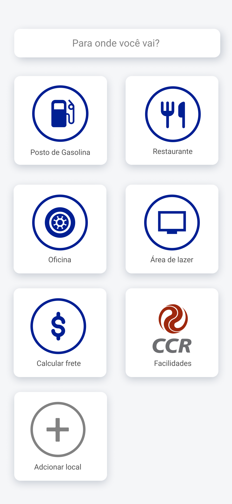
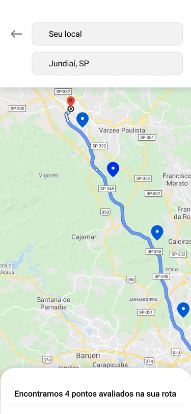
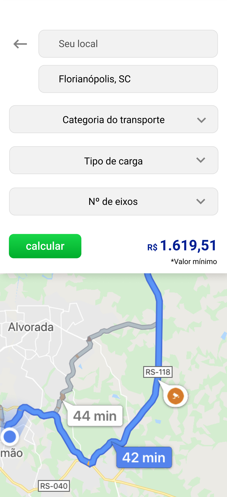

# HackathonCCR

* **Platform:** iOS (Swift)

## Descrição 
O Ponto certo é um app que visa auxiliar o caminhoneiro a fazer uma parada de qualidade, essencial para tornar sua rotina menos estressante.

## Screenshots

## Development Roadmap
* Mapa interativo :white_check_mark:
* Gerar geolocalizações a partir de buscas de interesse :white_check_mark:
* Configurar um banco de dados no Firebase e fazer a comunicaçāo do mesmo com o App :white_check_mark:
* Consolidaçāo de dados de diversos bancos de dados disponíveis :white_check_mark:
* Cálculo de rota entre 2 pontos geográficos :white_check_mark:
* Localização de pontos de parada próximo a rota :white_check_mark:
* Consolidação de informações sobre diferentes pontos de parada :white_check_mark:
* Registrar novos pontos de parada
* Registro colaborativo do preço do diesel nos postos
* Calcular o frete base para uma entrega
* Adaptação para outras plataformas
